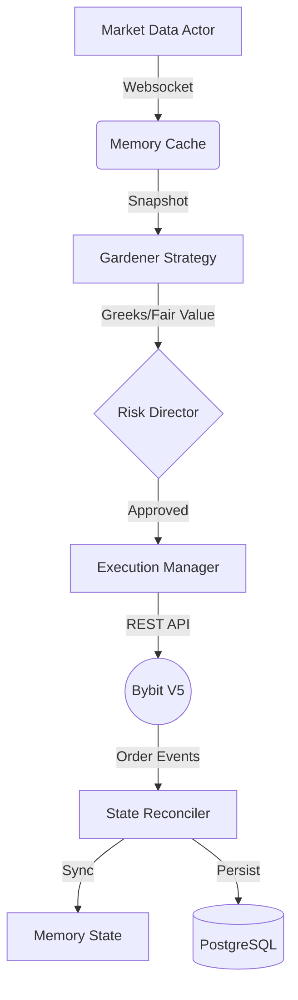

# AMM Robot (Automated Market Maker)

## Overview

AMM Robot — это автоматизированный маркет-мейкер для опционов на Bybit, реализующий концепцию "The Dream Machine". Система обеспечивает интеллектуальное управление ликвидностью с защитой от рисков и автоматическим ценообразованием.

## Архитектура

### Компоненты



### Модули

1. **AmmEngine** (`bybit_options/services/amm/engine.py`)
   - Главный оркестратор системы
   - Управляет жизненным циклом стратегий
   - Координирует работу всех компонентов

2. **MarketDataActor** (`bybit_options/services/amm/market_data.py`)
   - Подключение к Bybit WebSocket (Public)
   - Кэширование Mark Price и Mark IV
   - Подписка на тикеры опционов

3. **OptionPricing** (`bybit_options/services/amm/pricing.py`)
   - Расчет теоретической цены (Black-Scholes)
   - Вычисление Greeks (Delta, Gamma, Vega, Theta)
   - Производительность: ~53,000 опционов/сек

4. **AmmRepository** (`bybit_options/services/amm/repository.py`)
   - CRUD операции для стратегий и ордеров
   - Интеграция с PostgreSQL

## База Данных

### Схема

```sql
-- Стратегии
CREATE TABLE amm_strategies (
    id SERIAL PRIMARY KEY,
    name VARCHAR(100),
    target_iv DECIMAL(10, 4),      -- Целевая волатильность
    max_delta DECIMAL(10, 4),      -- Лимит дельты
    max_gamma DECIMAL(10, 4),      -- Лимит гаммы
    is_active BOOLEAN,
    is_paused BOOLEAN
);

-- Ноги стратегии
CREATE TABLE amm_legs (
    id SERIAL PRIMARY KEY,
    strategy_id INT REFERENCES amm_strategies(id),
    symbol VARCHAR(50),             -- BTC-26JUN26-100000-C
    side VARCHAR(10),               -- BUY/SELL
    ratio DECIMAL(10, 4),
    total_filled DECIMAL(20, 8)
);

-- Ордера
CREATE TABLE amm_orders (
    id SERIAL PRIMARY KEY,
    leg_id INT REFERENCES amm_legs(id),
    bybit_order_id VARCHAR(100),
    bybit_order_link_id VARCHAR(100) UNIQUE,
    price DECIMAL(20, 8),
    iv_at_creation DECIMAL(10, 4),
    status VARCHAR(20)
);
```

## Логика Работы

### 1. Ценообразование (Pricing)

**Формула:** `Price = Max(FairIV_Price, MarkIV_Price - Buffer)`

- **FairIV:** Целевая волатильность из стратегии
- **MarkIV:** Рыночная волатильность с биржи
- **Safety Anchor:** Защита от продажи ниже рынка

### 2. Execution Gating (Светофор)

```python
if portfolio_delta < -0.1 and new_order.side == 'SELL':
    return "GATE_PAUSED: Waiting for Puts to fill"
```

Предотвращает перекос портфеля во время набора позиции.

### 3. Order Management

**Новый ордер:**
- Расчет Fair Price
- Квантизация по tick_size
- `connector.place_order(PostOnly)`
- Сохранение в БД

**Изменение ордера:**
- Проверка отклонения (>0.5%)
- `connector.amend_order()`
- Обновление состояния

## Использование

### Запуск Engine

```python
from bybit_options.services.amm.engine import AmmEngine

engine = AmmEngine()
await engine.initialize()
await engine.run_loop()
```

### Создание Стратегии

```python
from bybit_options.services.amm.repository import AmmRepository
from bybit_options.services.amm.models import AmmStrategy, AmmLeg

repo = AmmRepository()

# Создать стратегию
strategy = AmmStrategy(
    name="BTC Strangle",
    target_iv=Decimal("0.50"),  # 50% IV
    max_delta=Decimal("1.0"),
    is_active=True
)
strategy_id = await repo.create_strategy(strategy)

# Добавить ноги
leg = AmmLeg(
    strategy_id=strategy_id,
    symbol="BTC-26JUN26-100000-C",
    side="SELL",
    ratio=Decimal("1.0"),
    target_size=Decimal("1.0")
)
await repo.create_leg(leg)
```

## Тестирование

### Unit Tests

```bash
python3 scripts/test_amm_logic.py
```

Проверяет:
- Расчет цен
- Логику Place/Amend
- Фильтрацию шума

### Миграции

```bash
python3 scripts/apply_amm_migration.py
```

## Конфигурация

### Environment Variables

```bash
BYBIT_API_KEY=your_key
BYBIT_API_SECRET=your_secret
BYBIT_TESTNET=false

DELTA_DB_HOST=localhost
DELTA_DB_PORT=5432
DELTA_DB_USER=trading_user
DELTA_DB_PASSWORD=your_password
DELTA_DB_NAME=trading_platform
```

## Безопасность

### Risk Limits

- **Delta Cap:** Максимальная дельта портфеля
- **Gamma Cap:** Ограничение гаммы
- **Vega Cap:** Лимит веги

### Execution Safety

- **PostOnly Orders:** Только Maker ордера
- **Price Deviation Filter:** Игнорирование изменений <0.5%
- **Reconciliation:** Синхронизация с биржей при старте

## Performance

- **Pricing:** 53,000 опционов/сек
- **Update Frequency:** 1 Hz (настраиваемо)
- **Latency:** <1ms для расчетов

## Roadmap

### Stage 1: Core ✅
- Database schema
- Engine initialization
- Pricing module

### Stage 2: Gardener ✅
- Market data integration
- Auto-pricing loop
- Order execution

### Stage 3: Gatekeeper (Planned)
- Delta gating logic
- Risk director
- Portfolio Greeks tracking

### Stage 4: Sniper (Planned)
- Event-driven arbitrage
- Opportunity scanner

### Stage 5: GUI (Planned)
- React dashboard
- Strategy management
- Real-time monitoring

## Troubleshooting

### Common Issues

**WebSocket не подключается:**
```bash
# Проверить pybit установлен
pip install pybit --break-system-packages
```

**Ошибка "Order not found":**
- Робот автоматически помечает ордер как CANCELLED
- Проверить reconciliation logic

**Высокая нагрузка на API:**
- Увеличить threshold для amend (>0.5%)
- Снизить частоту обновлений

## References

- [REQ-001: Requirements](../../.gemini/antigravity/brain/faaad6c8-b157-4294-9954-bc32e6404f9a/REQ-001-Automated-Market-Maker.md)
- [RFC-002: Architecture](../../.gemini/antigravity/brain/faaad6c8-b157-4294-9954-bc32e6404f9a/RFC-002-AMM-System-Design.md)
- [Bybit V5 API Docs](https://bybit-exchange.github.io/docs/v5/intro)
