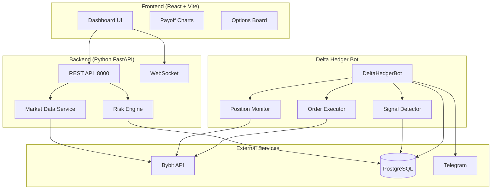

# Bybit Options Platform — Architecture

> **Status:** ACTIVE  
> **Last updated:** 2026-01-17  
> **Owner:** Tech Lead

---

## Overview

Платформа для анализа и автоматизированной торговли опционами на Bybit. Состоит из четырёх основных компонентов:



---

## Components

### 1. Risk Engine (Backend API)

**Purpose:** Расчёт греков, агрегация портфельного риска, REST API.

**Entry Point:** `api_example.py`  
**Port:** 8000

**Key Modules:**
| Module | Responsibility |
|--------|----------------|
| `api_example.py` | FastAPI endpoints |
| `risk_engine.py` | Black-Scholes Greeks |
| `payoff_calculator.py` | P&L projections |
| `live_state_keeper.py` | State management |
| `websocket_manager.py` | Real-time updates |
| `bybit_connector.py` | Bybit API wrapper |

**API Endpoints:**
- `GET /api/v1/options-board` — Options chain
- `GET /api/v1/risk/portfolio` — Portfolio Greeks
- `GET /api/v1/positions` — Current positions
- `GET /api/v1/payoff-chart` — P&L projections
- `WS /ws/portfolio` — Real-time updates

---

### 2. Delta Hedger Bot

**Purpose:** Автономное управление дельтой портфеля, хеджирование фьючерсами и опционами.

**Entry Point:** `scripts/run_hedger.py`  
**Port:** N/A (background service)

**Modes:**
| Mode | Trigger | Target Delta | Action |
|------|---------|--------------|--------|
| NEUTRAL | Default | 0.0 BTC | Micro-hedge with futures |
| DIRECTIONAL | H1 Breakout | ±0.01 BTC | Shift delta bias |
| DEFENSIVE | H4 Breakout | 0.0 BTC | Buy protective options |

**Key Modules:**
| Module | Responsibility |
|--------|----------------|
| `bot.py` | Main orchestration |
| `signal_detector.py` | H1/H4 fractal breakouts |
| `position_monitor.py` | Portfolio delta calculation |
| `order_executor.py` | Order placement with retry |
| `option_solver.py` | Option selection logic |

**Database Tables:**
- `hedge_actions` — Action log
- `hedger_config` — Runtime configuration
- `fractals_cache` — Fractal levels

---

### 3. Frontend (Dashboard)

**Purpose:** Визуализация опционной цепочки, портфельного риска, графиков P&L.

**Entry Point:** `frontend/src/index.tsx`  
**Port:** 3002

**Tech Stack:**
- React 18
- TypeScript
- Vite (bundler)
- Tailwind CSS
- Zustand (state)
- Recharts (charts)

**Key Files:**
| File | Purpose |
|------|---------|
| `services/api.ts` | REST client |
| `services/websocket.ts` | Real-time updates |
| `stores/portfolioStore.ts` | Global state |
| `components/OptionsBoard/` | Options chain table |
| `components/Portfolio/` | Risk metrics |

---

### 4. Delta Volume Analytics (PLANNED)

**Purpose:** Анализ объёмной дельты для улучшения точности сигналов фрактальной стратегии.

**Entry Point:** `scripts/run_delta_collector.py`  
**Status:** 📝 PLANNED (see [TZ](tz/delta_volume_analytics.tz.md))

**Components:**
| Module | Purpose |
|--------|---------|
| `LargeTradeCollector` | Сбор крупных сделок (>5 BTC) |
| `OrderbookCollector` | Snapshots стакана (imbalance) |
| `OICollector` | Open Interest Delta |
| `DeltaAnalyzer` | Расчёт метрик |
| `FractalEnricher` | Обогащение фракталов Delta-данными |
| `TelegramReporter` | Daily summary |

**Database Tables (TimescaleDB Hypertables):**
- `large_trades` — Whale trades (90d retention)
- `orderbook_snapshots` — OB state (30d retention)
- `open_interest` — OI changes (365d retention)
- `delta_metrics_1m/_5m/_1h` — Continuous Aggregates

---

## Data Layer

### PostgreSQL / TimescaleDB

**Tables:**

| Table | Purpose | Created By |
|-------|---------|------------|
| `hedge_actions` | Hedger action log | Migration 003 |
| `hedger_config` | Hedger configuration | Migration 003 |
| `fractals_cache` | H1/H4 fractal levels | Migration 004 |
| `perpetual_ohlcv` | BTCUSDT candles | External collector |

**Migrations:**
```
database_migrations/
├── 003_create_hedger_tables.sql
├── 004_create_fractals_tables.sql
└── 005_add_option_config_fields.sql
```

---

## Dependencies

### Python (Backend + Hedger)

```
fastapi
uvicorn[standard]
pybit
numpy
pandas
asyncpg
pydantic
websockets
python-dotenv
```

### Node.js (Frontend)

```
react
react-dom
typescript
vite
tailwindcss
recharts
zustand
lucide-react
```

---

## Configuration

See [`docs/ops/running.md`](ops/running.md) for:
- Environment variables
- Start commands
- Health checks
- Port assignments

---

## Development Workflow

1. **Backend changes:** Modify `bybit_options/services/` → Run tests → Restart uvicorn
2. **Hedger changes:** Modify `bybit_options/services/hedger/` → Run `pytest tests/test_hedger/`
3. **Frontend changes:** Modify `frontend/src/` → Vite hot-reloads automatically
4. **Database changes:** Create migration in `database_migrations/` → Apply with `psql`

---

## See Also

- [Runtime Configuration](ops/running.md)
- [Delta Hedger Tasklist](tasklist/HEDGER.tasklist.md)
- [Agent Conventions](../.agent/conventions.md)
- [Frontend README](../frontend/README.md)
