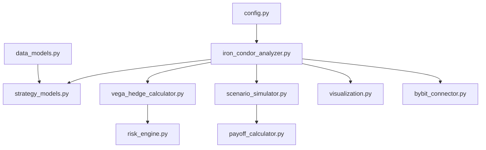

# Архитектурный план: Скрипт анализа стратегии Iron Condor + Vega Hedge

## 1. Обзор

**Цель**: Создать специализированный скрипт для анализа и оптимизации стратегии Iron Condor с Vega хеджированием в контексте Bybit Options Risk Engine.

**Контекст проекта**: Существующая система включает:

- `bybit_connector.py` - работа с API Bybit
- `risk_engine.py` - расчет греков (Black-Scholes)
- `payoff_calculator.py` - расчет P&L
- `live_state_keeper.py` - управление состоянием
- `data_models.py` - типы данных
- `analysis_orchestrator.py` - координация анализа

## 2. Требования к скрипту

### 2.1 Функциональные требования

1. **Конфигурация и настройка**:

   - Использование `pybit.unified_trading.HTTP` для рыночных данных
   - Захардкодированная структура позиции Iron Condor (4 ноги)
   - Загрузка API ключей из переменных окружения
   - Конфигурируемые параметры стратегии

2. **Получение данных**:

   - Получение реальных значений `vega`, `delta`, `gamma`, `theta`, `mark_price` для конкретных тикеров
   - Обработка пагинации и категории "option"
   - Получение данных по ATM опционам для хеджа

3. **Расчеты**:

   - Расчет Total Net Vega позиции Iron Condor
   - Расчет Unit Vega хеджа (страддл)
   - Вычисление Optimal_Hedge_Qty для достижения Vega Neutral
   - Учет знаков греков (продажа опционов = отрицательные греки)

4. **Анализ сценариев**:

   - Функция симуляции P&L на основе греков
   - Симуляция P&L для диапазона цен BTC (±15%)
   - Симуляция P&L для изменения IV (-10% до +20%)
   - Анализ чувствительности к параметрам

5. **Визуализация**:
   - Текстовый отчет с текущим Net Vega и рекомендуемым размером хеджа
   - График 1: Кривая P&L (цена BTC на X, P&L на Y) - сравнение текущего и вега-нейтрального портфеля
   - График 2: Тепловая карта P&L вега-нейтрального портфеля (цена BTC vs изменение IV)

### 2.2 Нефункциональные требования

- **Производительность**: Быстрый расчет для 4-х ног + хедж
- **Надежность**: Обработка ошибок API, отсутствия данных
- **Интегрируемость**: Совместимость с существующей структурой проекта
- **Поддерживаемость**: Четкие имена переменных, документация

## 3. Архитектура модулей

### 3.1 Предлагаемая структура файлов

```
bybit-options-risk-engine/
├── iron_condor_analyzer.py          # Основной скрипт анализа
├── strategy_models.py               # Модели данных для стратегий
├── vega_hedge_calculator.py         # Калькулятор вега-хеджа
├── scenario_simulator.py            # Симулятор сценариев
├── visualization.py                 # Визуализация результатов
└── config/
    └── iron_condor_config.yaml      # Конфигурация стратегии
```

### 3.2 Детальное описание модулей

#### 3.2.1 `iron_condor_analyzer.py` (Основной модуль)

**Ответственность**: Координация всего процесса анализа, интеграция всех компонентов.

**Основные классы**:

- `IronCondorAnalyzer`: Главный класс анализатора
- `IronCondorPosition`: Модель позиции Iron Condor

**Методы**:

- `__init__()`: Инициализация с конфигурацией
- `load_market_data()`: Загрузка рыночных данных для всех ног
- `calculate_greeks()`: Расчет греков для всей стратегии
- `analyze_vega_exposure()`: Анализ вега-экспозиции
- `run_analysis()`: Запуск полного анализа

#### 3.2.2 `strategy_models.py` (Модели данных)

**Ответственность**: Определение типов данных для стратегий.

**Основные классы**:

- `IronCondorLeg`: Модель одной ноги Iron Condor
- `IronCondorConfig`: Конфигурация стратегии
- `HedgePosition`: Модель хедж-позиции
- `AnalysisResult`: Результаты анализа

#### 3.2.3 `vega_hedge_calculator.py` (Калькулятор хеджа)

**Ответственность**: Расчет оптимального хеджа для нейтрализации вега-экспозиции.

**Основные классы**:

- `VegaHedgeCalculator`: Калькулятор вега-хеджа
- `StraddleHedge`: Модель страддл-хеджа

**Методы**:

- `calculate_net_vega()`: Расчет чистой вега-экспозиции
- `calculate_hedge_unit_vega()`: Расчет вега на единицу хеджа
- `calculate_optimal_hedge_qty()`: Расчет оптимального количества хеджа
- `calculate_vega_neutral_portfolio()`: Создание вега-нейтрального портфеля

#### 3.2.4 `scenario_simulator.py` (Симулятор сценариев)

**Ответственность**: Симуляция P&L для различных сценариев.

**Основные классы**:

- `ScenarioSimulator`: Симулятор сценариев
- `PriceScenario`: Сценарий изменения цены
- `IVScenario`: Сценарий изменения волатильности

**Методы**:

- `simulate_price_scenarios()`: Симуляция P&L при изменении цены
- `simulate_iv_scenarios()`: Симуляция P&L при изменении IV
- `calculate_sensitivity()`: Расчет чувствительности к параметрам

#### 3.2.5 `visualization.py` (Визуализация)

**Ответственность**: Генерация графиков и отчетов.

**Основные классы**:

- `ResultVisualizer`: Визуализатор результатов
- `ReportGenerator`: Генератор отчетов

**Методы**:

- `generate_text_report()`: Генерация текстового отчета
- `plot_pnl_curve()`: Построение кривой P&L
- `plot_heatmap()`: Построение тепловой карты
- `export_results()`: Экспорт результатов в файлы

## 4. Взаимодействие модулей



### 4.1 Поток данных

1. **Загрузка конфигурации** → `IronCondorAnalyzer`
2. **Получение рыночных данных** → `BybitConnector`
3. **Расчет греков** → `RiskEngine`
4. **Анализ вега-экспозиции** → `VegaHedgeCalculator`
5. **Симуляция сценариев** → `ScenarioSimulator`
6. **Визуализация результатов** → `ResultVisualizer`

## 5. Интерфейсы и зависимости

### 5.1 Зависимости от существующих модулей

- `bybit_connector.py`: Для получения рыночных данных
- `risk_engine.py`: Для расчета греков
- `payoff_calculator.py`: Для расчета P&L
- `data_models.py`: Для типов данных
- `config.py`: Для конфигурации

### 5.2 Новые интерфейсы

1. **IronCondorAnalyzer API**:

   ```python
   class IronCondorAnalyzer:
       def __init__(self, config: IronCondorConfig):
           pass

       async def run_analysis(self) -> AnalysisResult:
           pass

       def get_recommendations(self) -> List[str]:
           pass
   ```

2. **VegaHedgeCalculator API**:
   ```python
   class VegaHedgeCalculator:
       def calculate_optimal_hedge(
           self,
           iron_condor: IronCondorPosition,
           hedge_instrument: str
       ) -> HedgeRecommendation:
           pass
   ```

## 6. Детальные алгоритмы расчета

### 6.1 Структура Iron Condor

Iron Condor состоит из 4 ног:

1. **Short Put** (продажа put опциона с более низким страйком)
2. **Long Put** (покупка put опциона с еще более низким страйком)
3. **Long Call** (покупка call опциона с более высоким страйком)
4. **Short Call** (продажа call опциона с еще более высоким страйком)

**Пример для BTC:**

- Текущая цена: $95,000
- Short Put: BTC-19DEC25-90000-P
- Long Put: BTC-19DEC25-85000-P
- Long Call: BTC-19DEC25-100000-C
- Short Call: BTC-19DEC25-105000-C

### 6.2 Расчет греков для каждой ноги

#### 6.2.1 Получение данных от Bybit API

```python
# Использование существующего bybit_connector.py
async def get_option_greeks(symbol: str) -> Dict[str, float]:
    """Получить греки для опциона от Bybit API"""
    tickers = await connector.get_tickers(
        category="option",
        symbol=symbol
    )
    if tickers:
        ticker = tickers[0]
        return {
            "delta": float(ticker.get("delta", 0)),
            "gamma": float(ticker.get("gamma", 0)),
            "vega": float(ticker.get("vega", 0)),
            "theta": float(ticker.get("theta", 0)),
            "mark_price": float(ticker.get("markPrice", 0))
        }
    return None
```

#### 6.2.2 Учет знаков греков

**Правила знаков:**

- Long Call/Put: Греки берутся как есть (+)
- Short Call/Put: Греки умножаются на -1

**Таблица знаков:**
| Позиция | Delta | Gamma | Vega | Theta |
|---------|-------|-------|------|-------|
| Long Call | + | + | + | - |
| Short Call | - | - | - | + |
| Long Put | - | + | + | - |
| Short Put | + | - | - | + |

### 6.3 Расчет Net Vega для Iron Condor

#### 6.3.1 Формула

```
Net_Vega = Σ(Vega_leg_i * size_i * direction_i)
где:
  Vega_leg_i = raw vega от API (всегда положительная для опциона)
  size_i = количество контрактов
  direction_i = +1 для Long, -1 для Short
```

#### 6.3.2 Пример расчета

```python
def calculate_net_vega(legs: List[IronCondorLeg]) -> float:
    """Расчет чистой вега-экспозиции Iron Condor"""
    net_vega = 0.0

    for leg in legs:
        # Получаем raw vega от API
        raw_vega = leg.greeks["vega"]  # Положительное значение

        # Определяем направление
        if leg.side == "BUY":
            direction = 1.0  # Long
        else:
            direction = -1.0  # Short

        # Учитываем размер позиции
        leg_vega = raw_vega * leg.size * direction
        net_vega += leg_vega

    return net_vega
```

### 6.4 Расчет хеджа Vega Neutral

#### 6.4.1 Выбор инструмента хеджа

**ATM Straddle (страддл):**

- ATM Call: Ближайший к текущей цене call опцион
- ATM Put: Ближайший к текущей цене put опцион с тем же страйком

**Пример:** BTC-19DEC25-95000-C и BTC-19DEC25-95000-P

#### 6.4.2 Расчет Unit Vega хеджа

```
Unit_Vega_hedge = Vega_ATM_call + Vega_ATM_put
```

Для ATM опционов:

- Vega_call ≈ Vega_put (симметрично)
- Unit_Vega_hedge ≈ 2 \* Vega_ATM

#### 6.4.3 Расчет оптимального количества хеджа

```
Optimal_Hedge_Qty = -Net_Vega / Unit_Vega_hedge
```

**Объяснение:**

- Если Net_Vega отрицательный (чистая короткая вега), нужно купить хедж (положительное количество)
- Если Net_Vega положительный (чистая длинная вега), нужно продать хедж (отрицательное количество)

### 6.5 Симуляция P&L на основе греков (Greek-based P&L)

#### 6.5.1 Формула Taylor expansion

```
ΔP&L ≈ ΔS * Delta + 0.5 * (ΔS)^2 * Gamma + Δσ * Vega + Δt * Theta
где:
  ΔS = изменение цены (S_new - S_current)
  Δσ = изменение волатильности (σ_new - σ_current) в абсолютных единицах
  Δt = изменение времени в днях
```

#### 6.5.2 Упрощенная версия для анализа

Для быстрой симуляции можно использовать линейную аппроксимацию:

```
P&L(S, σ) ≈ (S - S0) * Delta_total + (σ - σ0) * Vega_total
```

#### 6.5.3 Реализация симуляции

```python
def simulate_pnl_greeks(
    portfolio_greeks: Dict[str, float],
    price_changes: np.ndarray,
    iv_changes: np.ndarray,
    time_days: float = 0
) -> np.ndarray:
    """
    Симуляция P&L на основе греков

    Args:
        portfolio_greeks: Суммарные греки портфеля
        price_changes: Массив изменений цены (% или абсолютные)
        iv_changes: Массив изменений IV (абсолютные, например 0.01 для +1%)
        time_days: Изменение времени в днях

    Returns:
        Массив P&L для каждого сценария
    """
    delta = portfolio_greeks["delta"]
    gamma = portfolio_greeks["gamma"]
    vega = portfolio_greeks["vega"]
    theta = portfolio_greeks["theta"]

    # Преобразование если price_changes в процентах
    if np.all(price_changes <= 1):  # Предполагаем проценты
        price_changes_abs = price_changes * current_price
    else:
        price_changes_abs = price_changes

    # Расчет P&L для каждого сценария
    pnl_array = (
        price_changes_abs * delta +                    # Delta component
        0.5 * price_changes_abs**2 * gamma +          # Gamma component
        iv_changes * vega +                           # Vega component
        time_days * theta                             # Theta component
    )

    return pnl_array
```

### 6.6 Анализ чувствительности (Greeks Sensitivities)

#### 6.6.1 Delta Neutral Check

```
Delta_total = Σ(Delta_leg_i * size_i * direction_i)
```

Цель: |Delta_total| < 0.01 BTC (практически дельта-нейтральный)

#### 6.6.2 Gamma Exposure

```
Gamma_total = Σ(Gamma_leg_i * size_i * direction_i)
```

Интерпретация:

- Положительный Gamma: Выигрываете от больших движений
- Отрицательный Gamma: Проигрываете от больших движений

#### 6.6.3 Theta Decay

```
Theta_total = Σ(Theta_leg_i * size_i * direction_i)
```

Интерпретация:

- Положительный Theta: Зарабатываете со временем (продажа временной стоимости)
- Отрицательный Theta: Платите за время (покупка временной стоимости)

### 6.7 Расчет Breakeven Points

#### 6.7.1 Метод решения уравнения

Найти S такие что:

```
P&L(S) = (S - S0) * Delta + 0.5 * (S - S0)^2 * Gamma + ... = 0
```

#### 6.7.2 Квадратное уравнение

Для упрощения (только Delta + Gamma):

```
0.5 * Gamma * ΔS^2 + Delta * ΔS = 0
ΔS * (0.5 * Gamma * ΔS + Delta) = 0
```

Решения:

1. ΔS = 0 (текущая цена)
2. ΔS = -2 \* Delta / Gamma

#### 6.7.3 Реализация

```python
def calculate_breakeven_points(
    delta: float,
    gamma: float,
    current_price: float
) -> List[float]:
    """Расчет точек безубыточности на основе греков"""
    breakeven_points = [current_price]  # Текущая цена всегда breakeven

    if abs(gamma) > 1e-10:
        # Второе решение квадратного уравнения
        delta_s = -2 * delta / gamma
        second_breakeven = current_price + delta_s
        breakeven_points.append(second_breakeven)

    return sorted(breakeven_points)
```

### 6.8 Валидация расчетов

#### 6.8.1 Проверка симметрии

Для Iron Condor должны выполняться:

- Delta_total ≈ 0 (дельта-нейтральный)
- Vega_total может быть значительным (требует хеджа)
- Theta_total > 0 (зарабатываете на временном распаде)

#### 6.8.2 Санк-чеки

1. Vega не может быть отрицательной для raw опциона
2. Gamma всегда положительная для raw опциона
3. Theta отрицательная для long опционов, положительная для short
4. Размеры позиций должны быть положительными

### 6.9 Оптимизация производительности

#### 6.9.1 Векторизованные расчеты

Использование NumPy для симуляции множества сценариев:

```python
import numpy as np

# Создание сетки сценариев
price_grid = np.linspace(-0.15, 0.15, 100)  # ±15% в 100 точках
iv_grid = np.linspace(-0.10, 0.20, 100)     # -10% до +20% IV

# Векторизованный расчет
price_mesh, iv_mesh = np.meshgrid(price_grid, iv_grid)
pnl_mesh = simulate_pnl_greeks_vectorized(price_mesh, iv_mesh)
```

#### 6.9.2 Кэширование результатов

Кэширование данных от API для повторных расчетов:

- TTL: 30 секунд для рыночных данных
- Кэширование греков для одинаковых параметров

## 7. Интерфейсы и интеграция с существующими модулями

### 7.1 Расширение существующих моделей данных

#### 7.1.1 Добавление в `data_models.py`

```python
# Новые модели для стратегий
class IronCondorLeg(BaseModel):
    """Модель одной ноги Iron Condor"""
    symbol: str
    side: PositionSide
    size: float
    strike: float
    option_type: OptionType
    greeks: Optional[Dict[str, float]] = None
    mark_price: Optional[float] = None

    @property
    def signed_vega(self) -> Optional[float]:
        """Вега с учетом направления позиции"""
        if not self.greeks or "vega" not in self.greeks:
            return None
        raw_vega = self.greeks["vega"]
        return raw_vega if self.side == PositionSide.BUY else -raw_vega

class IronCondorConfig(BaseModel):
    """Конфигурация Iron Condor стратегии"""
    underlying: str = "BTC"
    expiry: str  # e.g., "19DEC25"
    short_put_strike: float
    long_put_strike: float
    long_call_strike: float
    short_call_strike: float
    sizes: Dict[str, float] = {"short_put": 1.0, "long_put": 1.0,
                               "long_call": 1.0, "short_call": 1.0}

class HedgeRecommendation(BaseModel):
    """Рекомендация по хеджированию"""
    instrument_type: str  # "STRADDLE", "VANNA_HEDGE", etc.
    call_symbol: str
    put_symbol: str
    optimal_quantity: float
    unit_vega: float
    hedge_cost: Optional[float] = None
    effectiveness: float  # 0-1, насколько хорошо хеджирует

class AnalysisResult(BaseModel):
    """Результаты анализа стратегии"""
    timestamp: datetime = Field(default_factory=datetime.utcnow)
    config: IronCondorConfig
    net_vega: float
    net_delta: float
    net_gamma: float
    net_theta: float
    hedge_recommendation: Optional[HedgeRecommendation] = None
    scenario_analysis: Dict[str, Any] = Field(default_factory=dict)
    warnings: List[str] = Field(default_factory=list)
```

#### 7.1.2 Расширение `payoff_calculator.py`

Добавление поддержки стратегий:

```python
class StrategyPayoffCalculator(PayoffCalculator):
    """Калькулятор P&L для стратегий"""

    async def calculate_iron_condor_payoff(
        self,
        config: IronCondorConfig,
        current_price: float,
        days_to_expiry: int
    ) -> PayoffResult:
        """Расчет P&L для Iron Condor"""
        # Создание позиций из конфигурации
        positions = self._create_positions_from_config(config)
        return await self.calculate_payoff_at_expiry(
            positions=positions,
            current_price=current_price,
            days_to_expiry=days_to_expiry
        )
```

### 7.2 Интерфейсы новых модулей

#### 7.2.1 `IronCondorAnalyzer` API

```python
class IronCondorAnalyzer:
    """Анализатор стратегии Iron Condor"""

    def __init__(
        self,
        connector: BybitConnector,
        config: IronCondorConfig
    ):
        self.connector = connector
        self.config = config
        self.market_data = MarketDataService(connector)
        self.risk_engine = RiskEngine()

    async def run_full_analysis(self) -> AnalysisResult:
        """
        Запуск полного анализа стратегии

        Returns:
            AnalysisResult с полными результатами
        """
        # 1. Загрузка рыночных данных
        await self._load_market_data()

        # 2. Расчет греков
        greeks = await self._calculate_greeks()

        # 3. Анализ вега-экспозиции
        hedge_rec = await self._analyze_vega_exposure(greeks)

        # 4. Симуляция сценариев
        scenarios = await self._simulate_scenarios(greeks)

        # 5. Генерация отчета
        return self._build_result(greeks, hedge_rec, scenarios)

    async def get_recommendations(self) -> List[str]:
        """Получить текстовые рекомендации"""
        result = await self.run_full_analysis()
        return self._generate_recommendations(result)
```

#### 7.2.2 `VegaHedgeCalculator` API

```python
class VegaHedgeCalculator:
    """Калькулятор вега-хеджа"""

    def __init__(self, connector: BybitConnector):
        self.connector = connector

    async def calculate_optimal_straddle_hedge(
        self,
        net_vega: float,
        underlying_price: float,
        expiry: str
    ) -> HedgeRecommendation:
        """
        Расчет оптимального страддл-хеджа

        Args:
            net_vega: Чистая вега-экспозиция
            underlying_price: Текущая цена базового актива
            expiry: Дата экспирации

        Returns:
            Рекомендация по хеджированию
        """
        # 1. Найти ATM страйк
        atm_strike = self._find_atm_strike(underlying_price, expiry)

        # 2. Получить греки ATM опционов
        call_greeks = await self._get_option_greeks(
            f"{self.config.underlying}-{expiry}-{atm_strike}-C"
        )
        put_greeks = await self._get_option_greeks(
            f"{self.config.underlying}-{expiry}-{atm_strike}-P"
        )

        # 3. Расчет unit vega
        unit_vega = call_greeks["vega"] + put_greeks["vega"]

        # 4. Расчет оптимального количества
        optimal_qty = -net_vega / unit_vega if unit_vega != 0 else 0

        # 5. Расчет стоимости хеджа
        hedge_cost = self._calculate_hedge_cost(call_greeks, put_greeks, optimal_qty)

        return HedgeRecommendation(
            instrument_type="STRADDLE",
            call_symbol=f"{self.config.underlying}-{expiry}-{atm_strike}-C",
            put_symbol=f"{self.config.underlying}-{expiry}-{atm_strike}-P",
            optimal_quantity=optimal_qty,
            unit_vega=unit_vega,
            hedge_cost=hedge_cost,
            effectiveness=min(1.0, abs(optimal_qty * unit_vega / abs(net_vega)))
        )
```

#### 7.2.3 `ScenarioSimulator` API

```python
class ScenarioSimulator:
    """Симулятор сценариев для стратегий"""

    def __init__(self, payoff_calculator: PayoffCalculator):
        self.calculator = payoff_calculator

    async def simulate_price_scenarios(
        self,
        positions: List[PositionModel],
        current_price: float,
        price_range_pct: Tuple[float, float] = (-15.0, 15.0),
        points: int = 100
    ) -> PriceScenarioResult:
        """
        Симуляция P&L при изменении цены

        Args:
            positions: Список позиций
            current_price: Текущая цена
            price_range_pct: Диапазон изменения цены в %
            points: Количество точек для симуляции

        Returns:
            Результаты симуляции
        """
        # Генерация ценового диапазона
        min_price = current_price * (1 + price_range_pct[0] / 100)
        max_price = current_price * (1 + price_range_pct[1] / 100)
        price_range = np.linspace(min_price, max_price, points)

        # Расчет P&L для каждой цены
        pnl_results = []
        for price in price_range:
            result = await self.calculator.calculate_payoff_at_expiry(
                positions=positions,
                current_price=price,
                price_range_pct=5.0,  # Маленький диапазон вокруг каждой точки
                days_to_expiry=0  # Только intrinsic value
            )
            pnl_results.append(result.current_pnl)

        return PriceScenarioResult(
            price_range=price_range,
            pnl_array=np.array(pnl_results),
            current_price=current_price
        )

    async def simulate_iv_scenarios(
        self,
        positions: List[PositionModel],
        current_iv: float,
        iv_range_pct: Tuple[float, float] = (-10.0, 20.0),
        points: int = 100
    ) -> IVScenarioResult:
        """
        Симуляция P&L при изменении подразумеваемой волатильности

        Note: Использует Greek-based аппроксимацию
        """
        # Расчет суммарной вега
        total_vega = sum(p.greeks.vega_usd for p in positions if p.greeks)

        # Генерация диапазона IV
        iv_range = np.linspace(
            current_iv * (1 + iv_range_pct[0] / 100),
            current_iv * (1 + iv_range_pct[1] / 100),
            points
        )

        # Расчет P&L на основе вега
        pnl_array = total_vega * (iv_range - current_iv)

        return IVScenarioResult(
            iv_range=iv_range,
            pnl_array=pnl_array,
            current_iv=current_iv,
            total_vega=total_vega
        )
```

### 7.3 Интеграция с существующей системой

#### 7.3.1 Использование `config.py`

```python
# В основном скрипте
from config import get_config

config = get_config()
connector = BybitConnector(
    api_key=config.bybit.api_key,
    api_secret=config.bybit.api_secret,
    testnet=config.bybit.testnet
)

# Создание анализатора
analyzer = IronCondorAnalyzer(
    connector=connector,
    config=IronCondorConfig(
        underlying="BTC",
        expiry="19DEC25",
        short_put_strike=90000,
        long_put_strike=85000,
        long_call_strike=100000,
        short_call_strike=105000
    )
)
```

#### 7.3.2 Использование `analysis_orchestrator.py`

Расширение для поддержки стратегий:

```python
class EnhancedAnalysisOrchestrator(AnalysisOrchestrator):
    """Расширенный оркестратор с поддержкой стратегий"""

    async def analyze_strategy(
        self,
        strategy_config: Union[IronCondorConfig, Dict]
    ) -> AnalysisResult:
        """Анализ произвольной стратегии"""
        if isinstance(strategy_config, IronCondorConfig):
            analyzer = IronCondorAnalyzer(self.connector, strategy_config)
            return await analyzer.run_full_analysis()
        else:
            # Поддержка других стратегий
            raise NotImplementedError("Only Iron Condor supported for now")
```

#### 7.3.3 Интеграция с `live_state_keeper.py`

Для мониторинга стратегий в реальном времени:

```python
class StrategyMonitor:
    """Монитор стратегий в реальном времени"""

    def __init__(self, state_keeper: LiveStateKeeper):
        self.state_keeper = state_keeper
        self.active_strategies: Dict[str, IronCondorAnalyzer] = {}

    async def monitor_strategy(
        self,
        strategy_id: str,
        config: IronCondorConfig
    ):
        """Мониторинг стратегии в реальном времени"""
        analyzer = IronCondorAnalyzer(
            self.state_keeper.market_data.connector,
            config
        )
        self.active_strategies[strategy_id] = analyzer

        # Подписка на обновления портфеля
        while True:
            portfolio = self.state_keeper.get_portfolio_snapshot()
            if portfolio:
                # Проверка необходимости рехеджирования
                await self._check_rehedge(strategy_id, portfolio)

            await asyncio.sleep(60)  # Проверка каждую минуту
```

### 7.4 Миграционный путь

#### 7.4.1 Фаза 1: Изолированный скрипт

- Отдельный скрипт с захардкодированными параметрами
- Минимальная зависимость от существующей системы
- Фокус на корректности расчетов

#### 7.4.2 Фаза 2: Интеграция с моделями данных

- Добавление новых моделей в `data_models.py`
- Использование существующих `PositionModel`, `GreeksModel`
- Интеграция с `config.py` для загрузки настроек

#### 7.4.3 Фаза 3: Полная интеграция

- Расширение `analysis_orchestrator.py`
- Интеграция с `live_state_keeper.py` для мониторинга
- Добавление API endpoints для стратегий

#### 7.4.4 Фаза 4: Продвинутые функции

- Автоматическое рехеджирование
- Backtesting исторических данных
- Оптимизация параметров стратегии
- Интеграция с frontend для визуализации

## 8. Форматы вывода

### 8.1 Текстовый отчет

```
=== Iron Condor + Vega Hedge Analysis ===
Timestamp: 2025-12-26 12:00:00
Underlying: BTC @ $95,000

Iron Condor Position:
  Leg 1: BTC-19DEC25-90000-P (Short) - Vega: -$125.45
  Leg 2: BTC-19DEC25-85000-P (Long)  - Vega: +$98.76
  Leg 3: BTC-19DEC25-100000-C (Long) - Vega: +$87.65
  Leg 4: BTC-19DEC25-105000-C (Short) - Vega: -$112.34
  Total Net Vega: -$51.38

Vega Hedge Recommendation:
  Hedge Instrument: BTC-19DEC25-95000-C + BTC-19DEC25-95000-P
  Unit Vega: $245.67
  Optimal Quantity: 0.21 contracts
  Hedge Cost: $1,234.56

Scenario Analysis:
  Current P&L: -$123.45
  Max Profit: $2,345.67 @ $94,500
  Max Loss: -$1,234.56 @ $87,500 or $102,500
  Breakeven Points: $88,500, $101,500
```

### 8.2 Графики

1. **Кривая P&L**: Линейный график P&L vs цена BTC
2. **Тепловая карта**: 2D heatmap (цена BTC × изменение IV)

### 8.3 Файлы экспорта

- JSON: Полные результаты анализа
- CSV: Табличные данные для дальнейшей обработки
- PNG: Графики
- HTML: Интерактивный отчет

## 9. Интеграция с проектом

### 9.1 Использование существующей инфраструктуры

- **Конфигурация**: Использование `config.py` для загрузки API ключей
- **Логирование**: Использование существующей системы логирования
- **Модели данных**: Наследование от `BaseModel` из `data_models.py`
- **Расчеты**: Использование `risk_engine.py` для расчета греков

### 9.2 Минимальные изменения в существующий код

- Добавление новых моделей в `data_models.py`
- Расширение `payoff_calculator.py` для поддержки стратегий
- Обновление `analysis_orchestrator.py` для включения нового анализатора

## 10. Следующие шаги

1. **Реализация MVP**: Базовый функционал с захардкодированными параметрами
2. **Интеграция**: Подключение к существующей системе
3. **Тестирование**: Проверка расчетов на реальных данных
4. **Оптимизация**: Улучшение производительности и точности
5. **Документация**: Создание полной документации

---

_План будет уточнен после обсуждения с пользователем._
