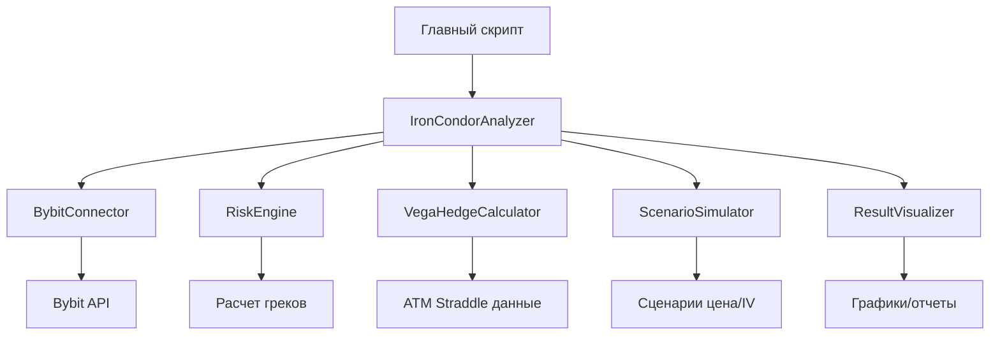

# Детальный архитектурный план: Скрипт анализа стратегии Iron Condor + Vega Hedge

## Резюме

**Цель**: Создать специализированный скрипт для анализа и оптимизации стратегии Iron Condor с Vega хеджированием в контексте Bybit Options Risk Engine.

**Ключевые возможности**:

1. Расчет греков для 4-х ног Iron Condor
2. Анализ вега-экспозиции и рекомендации по хеджированию
3. Симуляция P&L для различных сценариев (цена, IV)
4. Генерация отчетов и визуализация результатов
5. Интеграция с существующей системой Bybit Options Risk Engine

## 1. Архитектура модулей

### 1.1 Структура файлов

```
bybit-options-risk-engine/
├── iron_condor_analyzer.py          # Основной скрипт анализа
├── strategy_models.py               # Модели данных для стратегий
├── vega_hedge_calculator.py         # Калькулятор вега-хеджа
├── scenario_simulator.py            # Симулятор сценариев
├── visualization.py                 # Визуализация результатов
├── config/
│   └── iron_condor_config.yaml      # Конфигурация стратегии
└── tests/
    └── test_iron_condor_analyzer.py # Тесты
```

### 1.2 Взаимодействие модулей



## 2. Детальные алгоритмы расчета

### 2.1 Расчет Net Vega для Iron Condor

```
Net_Vega = Σ(Vega_leg_i * size_i * direction_i)
где:
  Vega_leg_i = raw vega от API (всегда положительная для опциона)
  size_i = количество контрактов
  direction_i = +1 для Long, -1 для Short
```

### 2.2 Расчет хеджа Vega Neutral

```
Unit_Vega_hedge = Vega_ATM_call + Vega_ATM_put
Optimal_Hedge_Qty = -Net_Vega / Unit_Vega_hedge
```

### 2.3 Симуляция P&L на основе греков

```
ΔP&L ≈ ΔS * Delta + 0.5 * (ΔS)^2 * Gamma + Δσ * Vega + Δt * Theta
```

## 3. Интерфейсы и API

### 3.1 Основной API анализатора

```python
class IronCondorAnalyzer:
    def __init__(self, connector: BybitConnector, config: IronCondorConfig):
        pass

    async def run_full_analysis(self) -> AnalysisResult:
        """Запуск полного анализа"""
        pass

    async def get_recommendations(self) -> List[str]:
        """Получить текстовые рекомендации"""
        pass
```

### 3.2 Модели данных

```python
class IronCondorConfig(BaseModel):
    underlying: str = "BTC"
    expiry: str  # "19DEC25"
    short_put_strike: float
    long_put_strike: float
    long_call_strike: float
    short_call_strike: float
    sizes: Dict[str, float]

class HedgeRecommendation(BaseModel):
    instrument_type: str  # "STRADDLE"
    call_symbol: str
    put_symbol: str
    optimal_quantity: float
    unit_vega: float
    hedge_cost: Optional[float]
    effectiveness: float
```

## 4. Обработка ошибок и валидация

### 4.1 Типы ошибок

1. **Ошибки API**: Таймауты, лимиты запросов (стратегия: ретраи с backoff)
2. **Ошибки данных**: Некорректные греки (стратегия: валидация + фолбэк)
3. **Ошибки расчета**: Деление на ноль (стратегия: предварительные проверки)
4. **Ошибки конфигурации**: Невалидные страйки (стратегия: валидация при инициализации)

### 4.2 Валидация данных

- Проверка порядка страйков: LP < SP < SC < LC
- Проверка положительности размеров позиций
- Валидация значений греков (vega > 0, gamma > 0)
- Проверка симметрии Iron Condor

## 5. Форматы вывода

### 5.1 Текстовый отчет

```
=== Iron Condor + Vega Hedge Analysis ===
Timestamp: 2025-12-26 12:00:00
Underlying: BTC @ $95,000

Iron Condor Position:
  Leg 1: BTC-19DEC25-90000-P (Short) - Vega: -$125.45
  Leg 2: BTC-19DEC25-85000-P (Long)  - Vega: +$98.76
  Leg 3: BTC-19DEC25-100000-C (Long) - Vega: +$87.65
  Leg 4: BTC-19DEC25-105000-C (Short) - Vega: -$112.34
  Total Net Vega: -$51.38

Vega Hedge Recommendation:
  Hedge Instrument: BTC-19DEC25-95000-C + BTC-19DEC25-95000-P
  Unit Vega: $245.67
  Optimal Quantity: 0.21 contracts
  Hedge Cost: $1,234.56

Scenario Analysis:
  Current P&L: -$123.45
  Max Profit: $2,345.67 @ $94,500
  Max Loss: -$1,234.56 @ $87,500 or $102,500
  Breakeven Points: $88,500, $101,500
```

### 5.2 Графики

1. **Кривая P&L**: Цена BTC vs P&L (сравнение текущего и вега-нейтрального портфеля)
2. **Тепловая карта**: Цена BTC × изменение IV vs P&L
3. **Диаграмма вклада греков**: Delta, Gamma, Vega, Theta contributions

### 5.3 Форматы экспорта

- JSON: Полные результаты для програмmatic использования
- CSV: Табличные данные для анализа в Excel/Google Sheets
- PNG: Графики для отчетов
- HTML: Интерактивный отчет с графиками

## 6. Интеграция с существующей системой

### 6.1 Использование существующих модулей

- `bybit_connector.py`: Для получения рыночных данных
- `risk_engine.py`: Для расчета греков
- `payoff_calculator.py`: Для расчета P&L
- `data_models.py`: Для типов данных (расширение)
- `config.py`: Для загрузки API ключей и настроек

### 6.2 Минимальные изменения

1. **Добавление новых моделей** в `data_models.py`:

   - `IronCondorLeg`, `IronCondorConfig`, `HedgeRecommendation`, `AnalysisResult`

2. **Расширение `payoff_calculator.py`**:

   - Добавление метода `calculate_iron_condor_payoff()`

3. **Обновление `analysis_orchestrator.py`**:
   - Добавление метода `analyze_strategy()`

### 6.3 Миграционный путь

**Фаза 1**: Изолированный скрипт с захардкодированными параметрами
**Фаза 2**: Интеграция с моделями данных и конфигурацией
**Фаза 3**: Полная интеграция с существующей системой
**Фаза 4**: Продвинутые функции (авто-хеджирование, backtesting)

## 7. План реализации

### 7.1 Неделя 1: Базовый функционал

- [ ] Создание `strategy_models.py` с моделями данных
- [ ] Реализация `vega_hedge_calculator.py` с базовыми алгоритмами
- [ ] Интеграция с `bybit_connector.py` для получения данных
- [ ] Тестирование на захардкодированных данных

### 7.2 Неделя 2: Полный анализ

- [ ] Реализация `iron_condor_analyzer.py` с полным workflow
- [ ] Добавление `scenario_simulator.py` для симуляции сценариев
- [ ] Интеграция с `risk_engine.py` для расчета греков
- [ ] Тестирование на реальных данных Bybit

### 7.3 Неделя 3: Визуализация и отчеты

- [ ] Реализация `visualization.py` с графиками
- [ ] Добавление форматов экспорта (JSON, CSV, PNG)
- [ ] Создание текстовых отчетов
- [ ] Тестирование визуализации

### 7.4 Неделя 4: Интеграция и оптимизация

- [ ] Интеграция с существующей системой
- [ ] Добавление обработки ошибок и валидации
- [ ] Оптимизация производительности
- [ ] Создание документации и примеров использования

## 8. Требования к тестированию

### 8.1 Unit-тесты

- Расчет Net Vega для различных конфигураций
- Расчет оптимального хеджа
- Симуляция P&L на основе греков
- Валидация входных данных

### 8.2 Интеграционные тесты

- Полный workflow анализа с реальными данными Bybit
- Интеграция с существующими модулями
- Обработка ошибок API

### 8.3 Тесты производительности

- Время выполнения полного анализа
- Потребление памяти при симуляции множества сценариев
- Масштабируемость для большого количества позиций

## 9. Риски и mitigation

### 9.1 Риск: Ненадежность данных Bybit API

- **Mitigation**: Ретраи с exponential backoff, фолбэк на теоретические значения
- **Mitigation**: Кэширование данных, валидация перед использованием

### 9.2 Риск: Неточность расчетов греков

- **Mitigation**: Сравнение с теоретическими значениями Black-Scholes
- **Mitigation**: Валидация симметрии для ATM опционов
- **Mitigation**: Мониторинг расхождений с другими источниками

### 9.3 Риск: Производительность при симуляции множества сценариев

- **Mitigation**: Векторизованные расчеты с NumPy
- **Mitigation**: Кэширование промежуточных результатов
- **Mitigation**: Оптимизация алгоритмов

## 10. Критерии успеха

### 10.1 Функциональные критерии

- [ ] Корректный расчет Net Vega для Iron Condor
- [ ] Точные рекомендации по вега-хеджированию
- [ ] Реалистичная симуляция P&L для различных сценариев
- [ ] Качественные отчеты и визуализация

### 10.2 Нефункциональные критерии

- [ ] Время выполнения анализа < 5 секунд
- [ ] Обработка ошибок API с graceful degradation
- [ ] Интеграция с существующей системой без breaking changes
- [ ] Полная документация и примеры использования

### 10.3 Бизнес-критерии

- [ ] Скрипт полезен для трейдеров options
- [ ] Экономия времени на ручные расчеты
- [ ] Улучшение качества решений по хеджированию
- [ ] Возможность расширения для других стратегий

## 11. Заключение

Предложенная архитектура обеспечивает:

1. **Модульность**: Четкое разделение ответственности между компонентами
2. **Интегрируемость**: Минимальные изменения в существующий код
3. **Надежность**: Комплексная обработка ошибок и валидация данных
4. **Расширяемость**: Возможность добавления новых стратегий и анализов
5. **Практичность**: Полезные отчеты и визуализация для конечных пользователей

Скрипт станет ценным дополнением к Bybit Options Risk Engine, предоставляя специализированный инструмент для анализа сложных options стратегий.

---

**Следующие шаги**:

1. Обсуждение плана с заинтересованными сторонами
2. Уточнение требований и приоритетов
3. Начало реализации по утвержденному плану
4. Регулярный review прогресса и корректировка плана при необходимости
