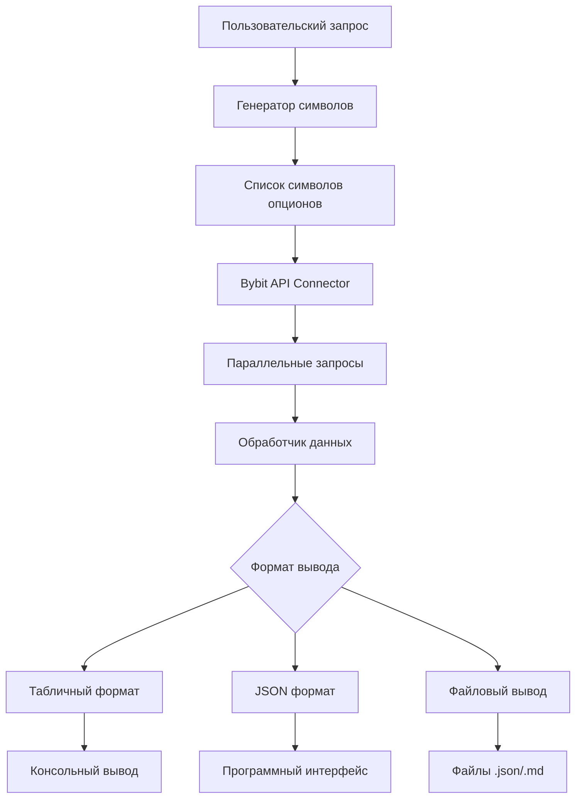

# План реализации: Получение данных доски опционов BTC-2JAN26

## Цель
Создать инструменты для получения данных доски опционов по фьючерсу BTC-2JAN26 со страйками от 75000 до 110000 с шагом 1000.

## Анализ текущего состояния проекта

### Существующая функциональность
1. **`bybit_connector.py`** - Асинхронный клиент API Bybit с:
   - Аутентификацией и подписью запросов
   - Ограничением скорости запросов (rate limiting)
   - Поддержкой категорий: spot, linear, inverse, option
   - Метод `get_tickers()` для получения рыночных данных

2. **`get_option_quotes.py`** - Скрипт для получения котировок отдельных опционов:
   - Табличный вывод с форматированием
   - Поддержка нескольких символов
   - Отображение Greeks, IV, ликвидности

3. **`get_option_quotes_json.py`** - JSON версия того же скрипта:
   - Структурированный вывод для автоматизации
   - Подробные данные по каждому опциону

4. **Инфраструктура проекта**:
   - Конфигурация через `.env` файл
   - Модели данных Pydantic
   - Логирование и обработка ошибок

### Требования пользователя
- Получить все опционы (коллы и путы) для BTC-2JAN26
- Диапазон страйков: 75000 - 110000
- Шаг: 1000
- Вывод в удобном формате для анализа

## Архитектурное решение

### Компоненты системы



### Новые скрипты

1. **`get_option_board.py`** - Основной скрипт для табличного вывода
2. **`get_option_board_json.py`** - Скрипт для JSON вывода
3. **`option_board_utils.py`** - Общие утилиты (опционально)

### Функциональные возможности

#### 1. Генерация списка символов
```python
def generate_option_symbols(
    base_coin: str = "BTC",
    expiry: str = "2JAN26",
    min_strike: int = 75000,
    max_strike: int = 110000,
    step: int = 1000,
    option_types: list = ["C", "P"]
) -> list[str]:
    """
    Генерирует список символов опционов по заданным параметрам
    """
```

#### 2. Получение данных опционов
```python
async def fetch_option_board(
    connector: BybitConnector,
    symbols: list[str],
    batch_size: int = 20
) -> dict:
    """
    Получает данные для списка символов опционов
    с пакетной обработкой для оптимизации
    """
```

#### 3. Форматирование вывода
- **Табличный формат**: Сортировка по страйкам, цветовое кодирование
- **JSON формат**: Полная структура данных для дальнейшей обработки
- **Markdown отчет**: Для сохранения и анализа

## Детальный план реализации

### Этап 1: Создание базовой инфраструктуры
1. **Создать `option_board_utils.py`** с функциями:
   - `generate_option_symbols()` - генерация символов
   - `parse_option_symbol()` - парсинг символа на компоненты
   - `calculate_moneyness()` - расчет денежности опциона (ITM/ATM/OTM)

2. **Интеграция с существующим кодом**:
   - Использовать `BybitConnector` из проекта
   - Подключить конфигурацию из `config.py`
   - Использовать существующие модели данных

### Этап 2: Реализация основного скрипта `get_option_board.py`
1. **Аргументы командной строки**:
   ```bash
   python get_option_board.py [--min-strike MIN] [--max-strike MAX] 
                              [--step STEP] [--type {call,put,all}]
                              [--output {table,json,md}] [--save FILE]
   ```

2. **Основной поток работы**:
   ```python
   async def main():
       # 1. Парсинг аргументов
       # 2. Генерация символов
       # 3. Инициализация коннектора
       # 4. Получение данных
       # 5. Обработка и форматирование
       # 6. Вывод результатов
   ```

3. **Форматирование таблицы**:
   - Сортировка по страйкам и типу
   - Цветовое выделение ITM/OTM опционов
   - Расчет спредов и ликвидности
   - Агрегация статистики по доске

### Этап 3: Реализация JSON скрипта `get_option_board_json.py`
1. **Структура JSON ответа**:
   ```json
   {
     "timestamp": "2025-12-18T17:30:00Z",
     "underlying_price": 86090.06,
     "expiry": "2JAN26",
     "strike_range": {"min": 75000, "max": 110000, "step": 1000},
     "options": [
       {
         "symbol": "BTC-2JAN26-75000-C-USDT",
         "strike": 75000,
         "type": "call",
         "moneyness": "ITM",  // in-the-money
         "prices": {...},
         "greeks": {...},
         "iv": {...},
         "liquidity": {...}
       }
     ],
     "statistics": {
       "total_options": 72,
       "calls": 36,
       "puts": 36,
       "avg_spread_percent": 1.23,
       "avg_iv": 0.556
     }
   }
   ```

### Этап 4: Дополнительные функции
1. **Фильтрация и сортировка**:
   - По типу опциона (call/put)
   - По денежности (ITM/ATM/OTM)
   - По ликвидности (объем, спред)

2. **Аналитические функции**:
   - Расчет подразумеваемого распределения (implied distribution)
   - Выявление аномалий в volatility smile
   - Расчет стоимости хеджирования

3. **Экспорт данных**:
   - CSV формат для Excel
   - Markdown отчеты
   - Графики volatility smile

### Этап 5: Тестирование
1. **Модульные тесты**:
   - Генерация символов
   - Парсинг ответов API
   - Форматирование данных

2. **Интеграционные тесты**:
   - Работа с реальным API (testnet)
   - Обработка ошибок сети
   - Проверка лимитов запросов

3. **Тестовые сценарии**:
   ```bash
   # Тест 1: Маленький диапазон
   python get_option_board.py --min-strike 80000 --max-strike 82000
   
   # Тест 2: Только коллы
   python get_option_board.py --type call
   
   # Тест 3: JSON вывод
   python get_option_board_json.py > test_output.json
   
   # Тест 4: Сохранение в файл
   python get_option_board.py --save option_board.md
   ```

### Этап 6: Документация
1. **README файл** для скриптов
2. **Примеры использования** с выводом
3. **Интеграция с существующей документацией**
4. **Шаблоны отчетов**

## Технические детали

### Ограничения API Bybit
1. **Rate limiting**: 50 запросов в секунду
2. **Максимальное количество символов в запросе**: 1000
3. **Формат символов**: `BTC-2JAN26-75000-C-USDT`

### Оптимизация производительности
1. **Пакетная обработка**: Запросы группами по 20-50 символов
2. **Параллельные запросы**: Использование `asyncio.gather`
3. **Кэширование**: Для повторяющихся запросов

### Обработка ошибок
1. **Отсутствующие опционы**: Пропуск неактивных страйков
2. **Проблемы с сетью**: Retry логика с экспоненциальной задержкой
3. **Невалидные данные**: Валидация через Pydantic модели

## Структура файлов

```
bybit-options-risk-engine/
├── get_option_board.py          # Основной скрипт (табличный вывод)
├── get_option_board_json.py     # JSON версия
├── option_board_utils.py        # Общие утилиты
├── docs/
│   └── OPTION_BOARD_README.md   # Документация
├── examples/
│   └── option_board_example.py  # Примеры использования
└── tests/
    └── test_option_board.py     # Тесты
```

## Временная оценка реализации

| Этап | Описание | Приоритет |
|------|----------|-----------|
| 1 | Базовая инфраструктура и утилиты | Высокий |
| 2 | Основной скрипт с табличным выводом | Высокий |
| 3 | JSON версия скрипта | Средний |
| 4 | Дополнительные функции и фильтры | Низкий |
| 5 | Тестирование и отладка | Высокий |
| 6 | Документация и примеры | Средний |

## Риски и митигация

### Риск 1: Изменения в API Bybit
- **Митигация**: Использовать официальную документацию, добавить версионирование API

### Риск 2: Большое количество запросов
- **Митигация**: Пакетная обработка, кэширование, использование testnet для разработки

### Риск 3: Неактивные опционы
- **Митигация**: Проверка наличия данных, graceful degradation

### Риск 4: Проблемы с производительностью
- **Митигация**: Оптимизация параллельных запросов, лимитирование скорости

## Заключение

Данный план описывает создание комплексного решения для получения и анализа доски опционов BTC-2JAN26. Решение будет интегрировано в существующую инфраструктуру проекта, использовать проверенные компоненты и предоставлять гибкие возможности для анализа рыночных данных.

Реализация начнется с базовой функциональности (получение данных и табличный вывод), затем будет расширена JSON версией и дополнительными аналитическими функциями.