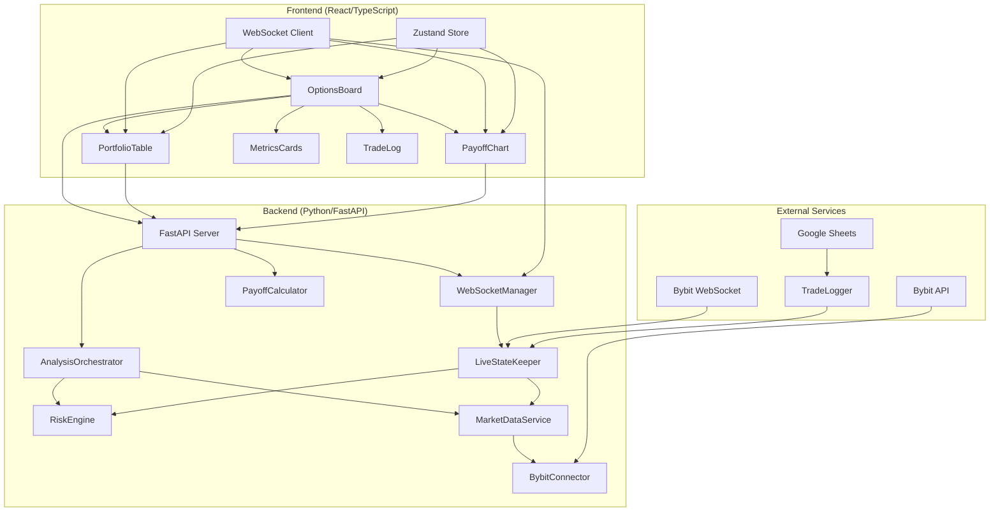
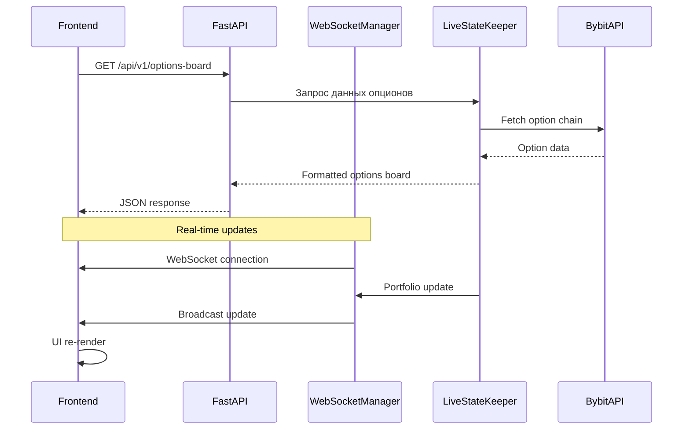

# Детальный план реализации веб-интерфейса для анализа опционного портфеля Bybit

## 📊 Текущее состояние проекта

### ✅ Реализованные компоненты (Backend ~60%)
- **`bybit_connector.py`** - Async API клиент Bybit с rate limiting
- **`risk_engine.py`** - Pure business logic для расчета Greeks (Delta, Gamma, Vega, Theta)
- **`live_state_keeper.py`** - Real-time обновления через WebSocket
- **`market_data_service.py`** - Сервис данных с кэшированием
- **`analysis_orchestrator.py`** - Оркестратор анализа
- **`api_example.py`** - FastAPI с базовыми endpoints
- **`data_models.py`** - Pydantic модели для type safety
- **`display_manager.py`** - Генерация Markdown отчетов для ИИ-агентов

### ❌ Требуется реализовать (Frontend 0%)
- Веб-интерфейс React + TypeScript
- Real-time WebSocket обновления
- Графики P&L (payoff diagrams)
- Доска опционов с фильтрацией
- Таблица позиций с цветовой индикацией
- Интеграция всех компонентов

## 🎯 Цели проекта

1. **Backend расширение** - Добавить недостающие API endpoints и WebSocket поддержку
2. **Frontend разработка** - Создать полнофункциональный веб-интерфейс
3. **Интеграция** - Обеспечить seamless взаимодействие frontend-backend
4. **Деплоймент** - Готовое решение для локального/облачного развертывания

## 🏗️ Архитектура системы

### Полная архитектура (Mermaid)



### Data Flow



## 📋 Детальный план реализации

### Этап 1: Backend расширение (Неделя 1)

#### 1.1 Создать `payoff_calculator.py`
**Цель**: Расчет графиков P&L на экспирацию

**Функциональность**:
- Расчет intrinsic value для опционов (CALL/PUT)
- Учет временного распада (Theta)
- Поиск точек безубыточности
- Генерация данных для графиков

**Интерфейс**:
```python
def calculate_payoff_at_expiry(
    positions: List[PositionModel],
    price_range: np.ndarray,
    include_theta: bool = False
) -> Dict[str, Any]
```

#### 1.2 Создать `websocket_manager.py`
**Цель**: WebSocket broadcast для real-time обновлений

**Функциональность**:
- Управление активными соединениями
- Broadcast обновлений портфеля
- Интеграция с `LiveStateKeeper`
- Graceful disconnect handling

**Ключевые классы**:
- `WebSocketManager` - основной менеджер соединений
- `ConnectionPool` - пул активных WebSocket соединений

#### 1.3 Расширить `api_example.py` новыми endpoints

**Добавить endpoints**:

1. **`GET /api/v1/options-board`**
   - Возвращает доску опционов с фильтрацией по экспирации
   - Поддержка фильтров: `base_coin`, `expiry`, `option_type`
   - Формат ответа оптимизирован для frontend таблиц

2. **`GET /api/v1/payoff-chart`**
   - Данные для графика P&L на экспирацию
   - Параметры: `days_to_expiry`, `price_range_pct`
   - Возвращает `price_range` и `pnl` массивы

3. **`WS /ws/portfolio`** (WebSocket)
   - Real-time обновления портфеля
   - Подписка на изменения позиций, Greeks, margin
   - Частота обновлений: 5 секунд

4. **`GET /api/v1/trade-log`**
   - Журнал сделок из Google Sheets/SQL
   - Фильтрация по дате, символу, типу
   - Пагинация и сортировка

#### 1.4 Модифицировать `live_state_keeper.py`
**Изменения**:
- Добавить интеграцию с `WebSocketManager`
- Реализовать callback для broadcast обновлений
- Оптимизировать частоту обновлений для WebSocket

### Этап 2: Frontend разработка (Недели 2-3)

#### 2.1 Настройка проекта React + TypeScript

**Структура проекта**:
```
frontend/
├── public/
├── src/
│   ├── components/
│   │   ├── OptionsBoard/       # Доска опционов
│   │   ├── Portfolio/          # Портфель и метрики
│   │   ├── Charts/             # Графики P&L
│   │   ├── TradeLog/           # Журнал сделок
│   │   └── Common/             # Общие компоненты
│   ├── services/
│   │   ├── api.ts              # REST API клиент
│   │   ├── websocket.ts        # WebSocket клиент
│   │   └── export.ts           # Экспорт данных
│   ├── stores/
│   │   └── portfolioStore.ts   # Zustand store
│   ├── types/
│   │   └── index.ts            # TypeScript типы
│   ├── utils/
│   │   └── formatters.ts       # Форматирование данных
│   └── App.tsx
```

**Зависимости**:
```json
{
  "dependencies": {
    "react": "^18.2.0",
    "react-dom": "^18.2.0",
    "@tanstack/react-table": "^8.0.0",
    "recharts": "^2.10.0",
    "date-fns": "^3.0.0",
    "zustand": "^4.0.0",
    "socket.io-client": "^4.7.0",
    "tailwindcss": "^3.0.0",
    "@radix-ui/react-tabs": "^1.0.0",
    "@radix-ui/react-dropdown-menu": "^2.0.0"
  }
}
```

#### 2.2 Компонент `OptionsBoard.tsx`

**Функциональность**:
- Отображение доски опционов с Greeks
- Фильтрация по экспирации (19DEC25, 26DEC25, 2JAN26)
- Сортировка по strike, IV, Greeks
- Экспорт данных для ИИ-агента (JSON + Markdown)
- Real-time обновления через WebSocket

**UI элементы**:
- Таблица с колонками: Strike, Type, Bid/Ask, Mark, IV, Delta, Gamma, Vega, Theta, OI
- Фильтры по expiry и option type
- Кнопки экспорта
- Индикатор underlying price

#### 2.3 Компонент `PortfolioTable.tsx`

**Функциональность**:
- Таблица позиций с P&L и Greeks
- Цветовая индикация (зеленый/красный для P&L)
- Группировка по base coin
- Суммарные метрики по портфелю
- Быстрые действия (close position, hedge)

**UI элементы**:
- Интерактивная таблица с сортировкой
- Progress bars для margin utilization
- Badges для risk warnings
- Tooltips с детальной информацией

#### 2.4 Компонент `PayoffChart.tsx`

**Функциональность**:
- Интерактивный график P&L на экспирацию
- Выбор expiry date для расчета
- Отображение точек безубыточности
- Сравнение сценариев (с учетом Theta/без)
- Zoom и панорамирование

**Библиотека**: Recharts
**Графики**:
- Основной график P&L vs Underlying Price
- Reference line для текущей цены
- Маркеры для breakeven points
- Tooltip с детальными значениями

#### 2.5 Компонент `MetricsCards.tsx`

**Функциональность**:
- Карточки с агрегированными метриками
- Real-time обновления через WebSocket
- Тренды (изменение за период)
- Цветовая индикация (норма/предупреждение/опасность)

**Метрики**:
- Total Delta (BTC/ETH эквивалент)
- Total Theta ($/day)
- Total Vega ($)
- Equity & Margin Utilization
- Portfolio Beta

#### 2.6 State Management (Zustand)

**Store структура**:
```typescript
interface PortfolioStore {
  // State
  positions: Position[]
  optionsBoard: OptionRow[]
  portfolioMetrics: PortfolioMetrics
  tradeLog: TradeEntry[]
  
  // Actions
  fetchOptionsBoard: (filters: OptionsFilter) => Promise<void>
  subscribeToUpdates: () => void
  unsubscribeFromUpdates: () => void
  exportData: (format: 'json' | 'md') => void
  
  // WebSocket
  wsConnected: boolean
  lastUpdate: Date | null
}
```

### Этап 3: Интеграция и тестирование (Неделя 4)

#### 3.1 Интеграционный план

**Шаги интеграции**:
1. Настройка CORS в FastAPI для frontend доступа
2. Разработка и тестирование API endpoints
3. Интеграция WebSocket соединения
4. Синхронизация Zustand store с backend данными
5. Реализация error handling и retry logic

**Конфигурация**:
```python
# FastAPI CORS
app.add_middleware(
    CORSMiddleware,
    allow_origins=["http://localhost:3000"],  # React dev server
    allow_credentials=True,
    allow_methods=["*"],
    allow_headers=["*"],
)
```

#### 3.2 План тестирования

**Unit Tests**:
- `payoff_calculator.py` - тесты расчета P&L
- `websocket_manager.py` - тесты соединений
- React компоненты - тесты рендеринга и взаимодействия

**Integration Tests**:
- API endpoints (FastAPI + pytest)
- WebSocket соединения
- Zustand store с реальными данными

**E2E Tests**:
- Полный workflow: login → dashboard → trading
- Cypress для frontend тестирования
- Тестирование real-time обновлений

#### 3.3 Responsive Design (1366x768+)

**Breakpoints**:
- Desktop: > 1366px - полный интерфейс
- Tablet: 768px - 1366px - адаптивные таблицы
- Mobile: < 768px - карточный интерфейс

**Адаптивные компоненты**:
- Таблицы → карточки на мобильных
- Графики → упрощенные версии
- Навигация → hamburger menu

#### 3.4 Экспорт данных для ИИ-агента

**Форматы**:
1. **JSON** - полные данные для програмmatic анализа
2. **Markdown** - читаемый формат для ChatGPT/Claude
3. **CSV** - для Excel/Google Sheets

**Структура экспорта**:
```json
{
  "metadata": {
    "timestamp": "2025-12-18T17:30:00Z",
    "underlying_symbol": "BTCUSDT",
    "underlying_price": 95000.50,
    "expiry": "19DEC25",
    "days_to_expiry": 7,
    "atm_strike": 95000,
    "atm_iv": 0.65
  },
  "options": [...],
  "portfolio_positions": [...],
  "ai_summary": "Portfolio is delta positive with moderate theta cost..."
}
```

## 🗓️ Roadmap и приоритизация

### Sprint 1 (Неделя 1): Backend Foundation
- [ ] Создать `payoff_calculator.py`
- [ ] Создать `websocket_manager.py`
- [ ] Добавить новые API endpoints
- [ ] Модифицировать `live_state_keeper.py`
- [ ] Написать unit tests для новых модулей

### Sprint 2 (Неделя 2): Frontend Core
- [ ] Настроить React + TypeScript проект
- [ ] Создать базовые компоненты (Layout, Navigation)
- [ ] Реализовать `OptionsBoard` компонент
- [ ] Интегрировать REST API клиент
- [ ] Настроить Tailwind CSS

### Sprint 3 (Неделя 3): Advanced Features
- [ ] Реализовать `PortfolioTable` с сортировкой
- [ ] Создать `PayoffChart` с Recharts
- [ ] Добавить WebSocket клиент
- [ ] Реализовать Zustand store
- [ ] Добавить экспорт данных

### Sprint 4 (Неделя 4): Polish & Integration
- [ ] Responsive design
- [ ] Error handling и loading states
- [ ] E2E тестирование
- [ ] Документация
- [ ] Деплоймент setup

## 🔧 Технические спецификации

### Backend API Endpoints

#### `GET /api/v1/options-board`
```http
GET /api/v1/options-board?base_coin=BTC&expiry=19DEC25&option_type=CALL
```

**Response**:
```json
{
  "underlying_price": 95000.50,
  "expiry": "19DEC25",
  "options": [
    {
      "strike": 90000,
      "type": "CALL",
      "bid": 1234.5,
      "ask": 1256.8,
      "mark": 1245.0,
      "iv": 0.65,
      "delta": 0.75,
      "gamma": 0.000045,
      "vega": 234.56,
      "theta": -45.67,
      "open_interest": 1500
    }
  ]
}
```

#### `GET /api/v1/payoff-chart`
```http
GET /api/v1/payoff-chart?days_to_expiry=7&price_range_pct=20
```

**Response**:
```json
{
  "current_price": 95000.50,
  "price_range": [76000.4, 78000.8, ..., 114000.6],
  "pnl": [-1500, -1200, ..., 3000],
  "breakeven_points": [89000, 101000],
  "max_profit": 4500.50,
  "max_loss": -1800.75
}
```

#### WebSocket `ws://localhost:8000/ws/portfolio`
**Message format**:
```json
{
  "type": "portfolio_update",
  "timestamp": "2025-12-18T17:30:00Z",
  "data": {
    "positions": [...],
    "metrics": {
      "total_delta": 0.5234,
      "total_theta": -123.45,
      "total_vega": 4567.89,
      "margin_utilization": 45.5
    }
  }
}
```

### Frontend TypeScript Types

```typescript
interface OptionRow {
  strike: number;
  type: 'CALL' | 'PUT